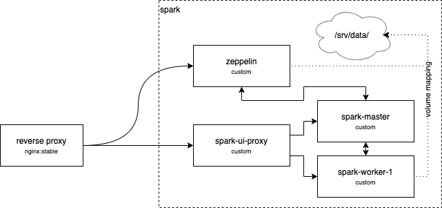
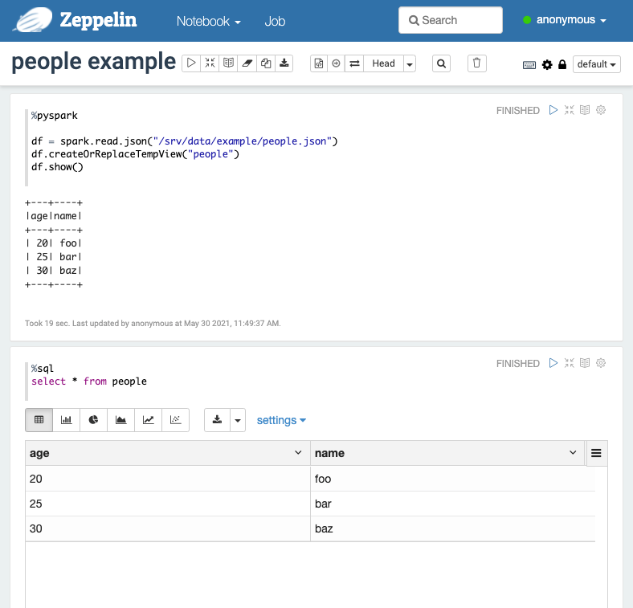

# Spark & Zeppelin via Docker

This repo contains Dockerfiles, scripts, and configs to run [Apache Spark](https://spark.apache.org/) and
[Apache Zeppelin](https://zeppelin.apache.org/) locally or on a server to play with Spark through Zeppelin.
In this setup we will use the local file system and not a distributed one.

## System Components

This diagram shows all the deployed Docker containers:




## Instructions

Note: You need to configure Docker to have at least 4 GB of memory.

1. Clone this repo `git clone https://github.com/sebastianhaeni/spark-zeppelin-docker.git`
1. Build the base image `docker build -f Dockerfile_base -t registry.local:5000/spark-zeppelin-demo/spark_base:latest .`
1. Build the remaining images `docker compose build`
1. Append the following to your `/etc/hosts` (Linux & MacOS) / `C:\Windows\System32\drivers\etc\hosts` (Windows) file
    ```
    127.0.0.1 zeppelin.local
    127.0.0.1 spark-ui-proxy.local
    ```
1. Run with `docker compose up`
1. Open [http://zeppelin.local/](http://zeppelin.local/) in your browser to access Zeppelin
1. Open [http://spark-ui-proxy.local/](http://spark-ui-proxy.local/) in your browser to access Spark

And there you go. An example notebook is included as well to get you going:




## Components 


### Reverse Proxy

The reverse proxy allows us to proxy to an internal container by server name.
So we don't have to map ports from the internal Docker network and we don't have
to remember names.


### Spark and Zeppelin

#### Base Image

The Spark and Zeppelin images both depend on a base image, that we have to build beforehand.

This image contains:

* JDK
* Scala
* Anaconda & Python
* Apache Spark
* Apache Zeppelin

The reason why we create a single image with both Spark and Zeppelin, is that Spark needs
some JARs from Zeppelin (namely the spark interpreter jar) and Zeppelin needs some Spark JARs
to connect to it. Also, Spark needs Anaconda (Python) to run PySpark. Zeppelin has a pure Python
interpreter that also needs Anaconda (to be able to achieve something meaningful).

If you need to add another Python package to the image, you can do so either with `conda install`
or `pip install` at the end of `Dockerfile_base`. Please be sure to rebuild the images
after doing so.

#### Apache Spark

The current configuration will create the following 3 containers:

* spark-master: Spark Master Node where workers connect
* spark-worker-1: A worker node, connecting to the master. Could be scaled.
  * Please note that the amount of CPU cores and memory to be reserved by the worker are defined in `Dockerfile_worker`
    and can be optionally overwritten by environment variables.
* spark-ui-proxy: To access the nodes' web UI, we need to transform the content with correct URLs (they don't properly support reverse proxies)

Please note that the Spark nodes have a volume mapping to `./data` . This is where you can place files to read in your Zeppelin notebook.
An example file is already provided.

``` python
%pyspark
df = spark.read.json("/srv/data/example/people.json")
```

#### Apache Zeppelin

Zeppelin will be connected to the Spark Master (Spark Interpreter) once you run the first Spark cell in a notebook.

#### Compatibility Issues

Please note that Spark, Zeppelin, Python, JDK, Scala have to be compatible to each other.
In the current setup, these have been tested and matched to each other. For example, this would
not work:

* Upgrade from JDK 1.8 to e.g. 11. You will run into some class not found issues when running Zeppelin.
* Upgrade from Python 3.7 to Python 3.8. You will notice weird errors when running a PySpark script.

So if there's a need to upgrade, please reserve enough time to test the compatibility between those
systems well enough.

A good approach can be a test notebook in Zeppelin containing blocks with Scala, Python, PySpark and
SQL interpreters. Run them all successfully, and you basically proved that the system works.
